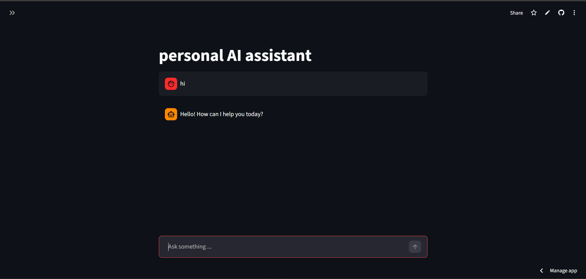
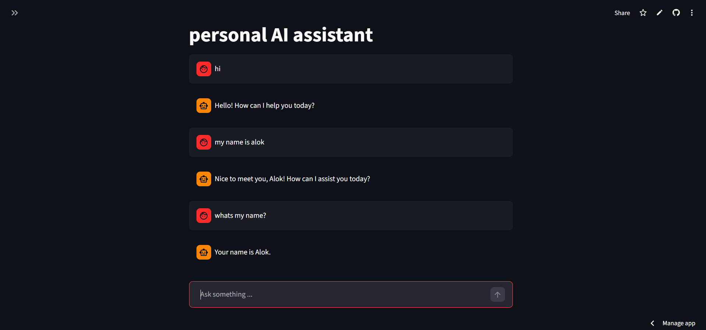
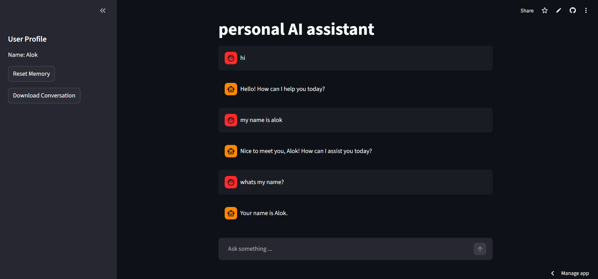
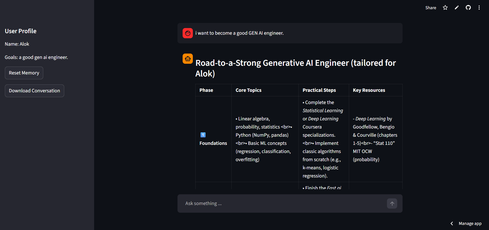

# Personal AI Assistant with Memory

## Overview

**Personal AI Assistant with Memory** is a Generative AI application that remembers user information across conversations and personalizes responses accordingly.

The assistant stores user facts such as:

* name
* goals
* preferences

These memories are retrieved and injected into the prompt so the AI can provide **context-aware and personalized responses**.

The project demonstrates key **GenAI engineering concepts** including:

* conversation memory
* persistent user memory
* memory reasoning
* prompt personalization
* LLM integration

---

# Live Demo

**Live App:**
🔗 [Live Link](https://alok-personal-ai-assistant.streamlit.app/)

---

# Screenshots

## Chat Interface



---

## Personalized Responses



---

## Memory Viewer Panel



---

## Conversation Example



---

# Features

* Conversational AI chatbot
* Persistent user memory across sessions
* Memory extraction from user messages
* Memory reasoning to avoid duplicates or contradictions
* Personalized responses using stored memory
* Streamlit chat interface
* Memory viewer panel in sidebar
* Reset memory option
* Conversation export feature

---

# System Architecture

```
User Input
     ↓
Conversation Memory (short-term)
     ↓
Memory Extraction
     ↓
Memory Reasoning
     ↓
Memory Storage (JSON)
     ↓
Memory Retrieval
     ↓
Prompt Construction
     ↓
Groq LLM
     ↓
Personalized AI Response
```

---

# Project Structure

```
personal-ai-assistant/

app.py
llm.py
conversation_manager.py
memory_extractor.py
memory_manager.py
memory_reasoner.py

memory.json
requirements.txt
.env

screenshots/
   image1.png
   image2.png
   image3.png
   image4.png
```

---

# Tech Stack

* Python
* Streamlit
* Groq LLM
* JSON (memory storage)
* Python Regex (fact extraction)

---

# Installation

Clone the repository:

```
git clone https://github.com/Alok-kumar-priyadarshi/personal-AI-assistant
cd personal-ai-assistant
```

Install dependencies:

```
pip install -r requirements.txt
```

---

# Environment Setup

Create a `.env` file in the project root:

```
GROQ_API_KEY=your_api_key_here
```

---

# Run the Application

Start the Streamlit app:

```
streamlit run app.py
```

Open in browser:

```
http://localhost:8501
```

---

# Memory System

The assistant uses **two types of memory**.

### Short-Term Memory

Stored in:

```
Streamlit session state
```

Purpose:

* maintain conversation history

---

### Long-Term Memory

Stored in:

```
memory.json
```

Purpose:

* store user facts permanently

Example memory:

```json
{
  "name": "Alok",
  "goals": ["Become AI engineer"],
  "preferences": {
    "programming_languages": ["python"]
  }
}
```

---

# Example Interaction

User:

```
My name is Alok and I want to become an AI engineer
```

Assistant stores memory.

Later user asks:

```
How should I learn machine learning?
```

Assistant response becomes personalized:

```
Since your goal is to become an AI engineer,
you should start with Python, linear algebra,
and machine learning fundamentals.
```

---

# Deployment

This application can be deployed easily using **Streamlit Cloud**.

Steps:

1. Push project to GitHub
2. Go to Streamlit Cloud
3. Create new app
4. Select repository
5. Set `app.py` as entry point
6. Add `GROQ_API_KEY` in Streamlit Secrets


---

# Learning Outcomes

This project demonstrates:

* building GenAI applications
* implementing memory in LLM systems
* prompt engineering
* conversational AI architecture
* deploying AI apps with Streamlit


